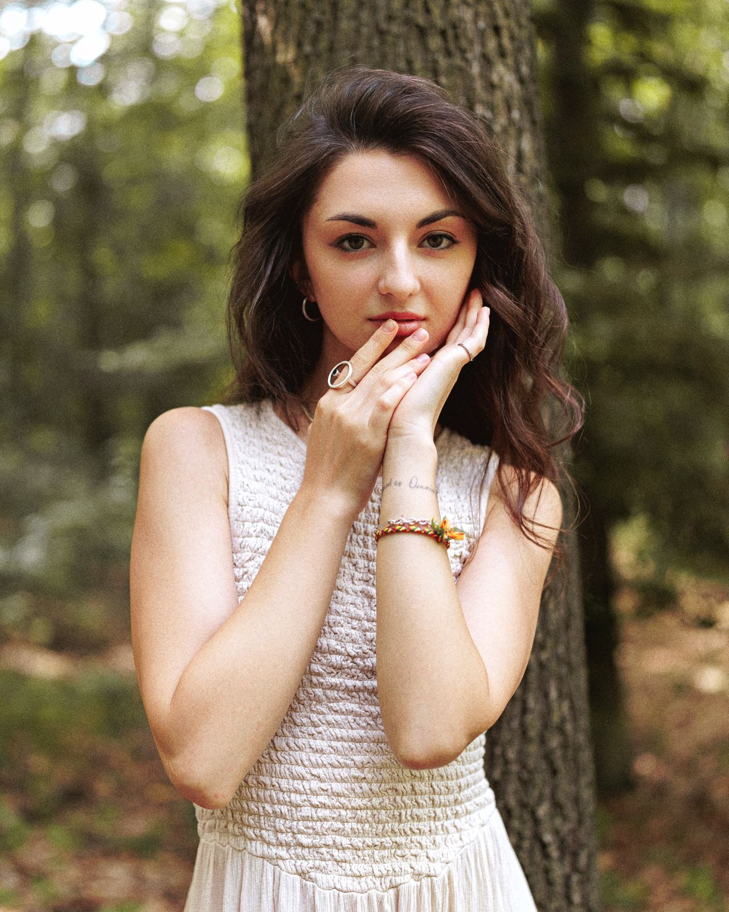

# Лендинг

Статическая страница для холодного трафика. Единственная цель — довести
человека до записи. Сама запись остаётся в боте: страница никуда не ходит,
ничего не бронирует и не имеет бэкенда.

Спека и обоснование решений: `docs/superpowers/specs/2026-08-10-web-redesign-v5-design.md`.

## Почти без JS — сознательно, а не пока не дошли руки

Страница — готовый экспорт React-бандла от Ланы, где JS отвечал за три вещи.
Две из трёх сделаны заново на голом HTML/CSS, рантайм выброшен целиком:
276 КБ фреймворка ушли, остались 15 строк на стрелки ленты отзывов
(`test_no_framework_only_tiny_inline_script` сторожит, что внешних скриптов
нет, инлайновый ровно один и он не разросся).

- **Аккордеон FAQ.** Шесть `<details class="faq-item" name="faq">`
  (секция `#faq`). Общий `name="faq"` у всех — нативный механизм HTML5:
  браузер сам закрывает остальные `<details>` той же группы при открытии
  одного, никакого слушателя кликов не нужно. Секция открывается
  свёрнутой: в бандле первый вопрос был раскрыт (`state.open` стартовал
  с нуля), но раскрытый ответ оттягивал внимание и удлинял секцию на
  первый взгляд. Раньше это была отдельная дизайн-система
  (`LanaLeonovichDesignSystem` из бандла) — теперь один HTML-атрибут.
- **Ховеры кнопок** — на классах `.btn-accent` / `.btn-invert` в `<style>`,
  не на JS-обработчиках.
- **Лента отзывов** свайпается через `scroll-snap`, не JS-карусель:
  `.reviews-track` (`overflow-x:auto; scroll-snap-type:x mandatory`) +
  `.review-card` (`scroll-snap-align:start`), семь карточек
  (`test_reviews_are_a_swipe_track`).

### Единственный скрипт: стрелки ленты отзывов

Свайп решает задачу только на тачскрине. На десктопе жеста нет, а полосу
прокрутки у ленты мы прячем (`scrollbar-width:none`) — остаётся Shift+колесо,
о котором никто не знает. То есть на десктопе лента выглядела статичной
и половина отзывов была недостижима.

Стрелки нельзя сделать на голом CSS: «следующий» и «предыдущий» требуют
знать текущую позицию, а CSS состояния прокрутки не видит. Отсюда 15 строк
инлайнового скрипта в конце `<body>`: `scrollBy` на ширину карточки плюс
`gap`, и гашение стрелки на краю по `scrollLeft`. Показываются только мыши —
`@media (hover:hover) and (pointer:fine)`.

Если возникнет соблазн добавить сюда ещё JS (аналитику, форму, что угодно) —
имейте в виду, что скудность скрипта зафиксирована тестом как требование, а
не случайность: `test_no_framework_only_tiny_inline_script` придётся
осознанно ослабить, а не обходить костылём.

### Ховерам нужен `!important`, иначе они молча не работают

```css
.btn-accent:hover{background:#C8705A!important;color:#fff!important}
.btn-invert:hover{background:#fff!important;color:#2B3366!important}
```

У всех девяти кнопок в разметке — свой инлайновый `style="background:…;
color:…"` (так их красил бандл-экспорт, переписывать каждую в чистый класс
без необходимости смысла нет). Инлайновый `style` всегда весомее
class-селектора по специфичности CSS, поэтому без `!important` `:hover`
компилируется и матчится, но фон при наведении не меняется — кнопка молча
не реагирует. Раньше ту же роль играл `style-hover="…"` — атрибут, который
понимал только выброшенный React-рантайм, а в статике браузер его просто
игнорирует (`test_no_runtime_placeholders` следит, чтобы он не просочился
обратно). Проверено вживую через CDP-hover, не только чтением кода.

### Ленте отзывов обязателен `overscroll-behavior-x:contain`

```css
.reviews-track{overflow-x:auto;scroll-snap-type:x mandatory;
  overscroll-behavior-x:contain;…}
```

Без него свайп до последней или первой карточки на iOS не гасится на
границе ленты, а «протекает» в жест навигации Safari — страница уходит
назад по истории прямо посреди чтения отзывов. `overscroll-behavior-x`
перехватывает именно горизонтальный оверскролл, не трогая вертикальный
скролл страницы.

## Шрифты свои — и это не про скорость

`Golos Text` (текст) и `Prata` (заголовки), восемь `woff2` в
`web/assets/fonts/` — по четыре сабсета на шрифт (кириллица,
кириллица-ext и латинские варианты, набор чуть отличается между
шрифтами), подключены через `@font-face` прямо в `<style>`. Ни одного
обращения к `fonts.googleapis.com`/`fonts.gstatic.com`
(`test_fonts_are_self_hosted` проверяет оба домена и что
`assets/fonts/` встречается на странице не меньше 8 раз).

Дело не в скорости загрузки, хотя self-hosted и с этим лучше. П. 12.3
Политики конфиденциальности утверждает, что Оператор не использует на
сайте аналитику, ретаргетинг и пиксели соцсетей, а п. 12.2 — что сбора
данных посетителей нет. Google Fonts — технически сторонний запрос:
каждый визит отдаёт Google IP-адрес посетителя ещё до того, как человек
на странице что-либо нажал. Держать шрифты в `assets/fonts/` — единственный
способ, чтобы это утверждение оставалось правдой, а не рекламной фразой.

`Inter`, на котором стояла предыдущая версия страницы, не используется —
`test_no_stray_inter` следит, чтобы `font-family: Inter` не просочился
обратно, если однажды снова будут копировать стили из старого черновика.

Цвет: тёплый светлый фон `#FAFAF7`, текст `#1C1C2E`, акцент терракота
`#C8705A` (ссылки, лейблы, обводки), тёмно-синий `#2B3366` (кнопки-CTA,
футер), приглушённый `#6B6560` на длинных абзацах. Секции чередуют белый
фон с тёплым `#F5EDE3`.

## Юридические документы

Оферта, политика конфиденциальности и информированное согласие — Google
Docs Ланы (форма `/preview`, открываются в браузере без входа в аккаунт),
три ссылки в футере. Копий этих текстов в репозитории больше нет.

Раньше они дублировались в `web/legal/*.html` — Лана правила исходный
docx, а обновлять HTML-копию приходилось руками отдельным шагом. Как
только бот в PR #26 перешёл на прямые ссылки на Google Docs
(`LEGAL_*_URL` в `keyboards/inline.py`), вторая копия в репозитории стала
чистым риском без пользы: рано или поздно кто-то поправит документ и
забудет про HTML-дубль, и бот с сайтом начнут показывать разные редакции.
`web/legal/` удалена целиком — теперь и бот, и сайт смотрят в один и тот
же источник. `test_legal_links_point_to_google_docs` проверяет, что все
три id документов есть на странице и что пустых `href="#"` не осталось.

Четвёртый документ — крипто-дисклеймер (`LEGAL_CRYPTO_URL`) — в футере
сайта не показан: он нужен только на экране крипто-оплаты в боте, на
сайте до него нет повода дойти.

## Фотография

Портрет — кадр 1280×1600 (`web/assets/lana.jpg` и `.webp`), не 1600×2000.
Исходник от Ланы — JPEG 3304×4130, 11,8 МБ прямо из Photoshop, фон лесной
и шумный (кора дерева, боке из листвы) — много мелкой высокочастотной
детали. При фиксированном весовом бюджете это дорого обходится webp: на
1600×2000 бюджет продавливал quality до 43 с заметной потерей резкости на
лице (замер дисперсией Лапласиана — 52–72 % резкости от jpg на том же
quality). На 1280×1600 тот же вес держит quality 67 (jpg — 78) без видимой
потери. `test_image_weight_budget` держит потолок на будущее: webp < 200 КБ
(сейчас ≈195, у самой границы), jpg < 400 КБ (≈336), og.jpg < 200 КБ (≈173).

Разметка — `<picture>` с webp и jpg-фолбэком:

```html
<div style="aspect-ratio:4/5;…">
  <picture>
    <source srcset="assets/lana.webp" type="image/webp">
    
  </picture>
</div>
```

Пропорцию 4:5 задаёт `aspect-ratio` на обёртке, а не на самой ``.
Внутри `` CSS-`width` и CSS-`height` прописаны явно и оба (`100%`/
`100%`) — не «ширина 100%, высота по наитию». Если оставить только
ширину, браузер досчитает высоту через presentational hint из
HTML-атрибутов `width="1280" height="1600"`, то есть по пропорции самой
картинки, а не контейнера. Сейчас они случайно совпадают (1280:1600 —
тоже 4:5), поэтому разницы не видно, но при следующей смене фото на кадр
с другим кадрированием на этом легко споткнуться. Старая версия страницы
уже ловила соседний вариант той же ошибки: атрибут `height="2000"`
перебивал `aspect-ratio` в CSS, и портрет растягивался на все 2000px.
Правило то же, вне зависимости от конкретной техники: у портрета CSS
обязан размечать оба измерения явно, никогда не полагаясь на одну лишь
ширину и presentational hint из атрибутов.

`assets/og.jpg` — отдельный кадр 1200×630 только для превью при
пересылке ссылки (`og:image`), в самой странице `` на него не
ссылается. Адреса в блоке `og:*` обязаны быть абсолютными
(`https://alania.vercel.app/…`) — Telegram и другие мессенджеры
разворачивают превью, не открывая страницу целиком, и относительный путь
для них не ссылка, а мусор (`test_head_carries_seo_and_preview` проверяет
сам блок, но не абсолютность — это на глаз при правке).

## Локальный просмотр

```bash
python -m http.server 4321 --directory web
```

## Деплой на Vercel

vercel.com → Add New → Project → импорт `PavelMalachovski/alania` →
**Root Directory: `web`**, Framework Preset: Other, команда сборки пустая.
Остальное по умолчанию.

Заголовки кеширования лежат в `vercel.json` рядом. Всё под `/assets/*`
(фото, og-кадр, шрифты, favicon) отдаётся сутки со
`stale-while-revalidate` на неделю, а не «навсегда»: имена файлов не
содержат хеша, и с `immutable` замена снимка не доехала бы до тех, кто
уже был на странице.

## Известное расхождение с ботом

Ссылки ведут в бота с параметром `?start=site`, но `cmd_start` в
`handlers/start.py` payload команды не разбирает вообще — просто чистит
FSM-состояние и показывает главное меню, что бы ни стояло после
`?start=`. Человек попадёт на общий экран, а не сразу в раздел записи.
Разделы доступны с нижней клавиатуры, так что тупика нет, но обещание
кнопки не выполняется буквально. Чинится небольшой правкой в боте —
разбором `command.args`.
